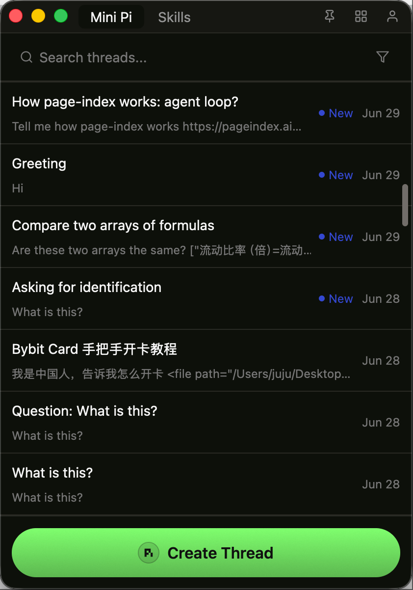
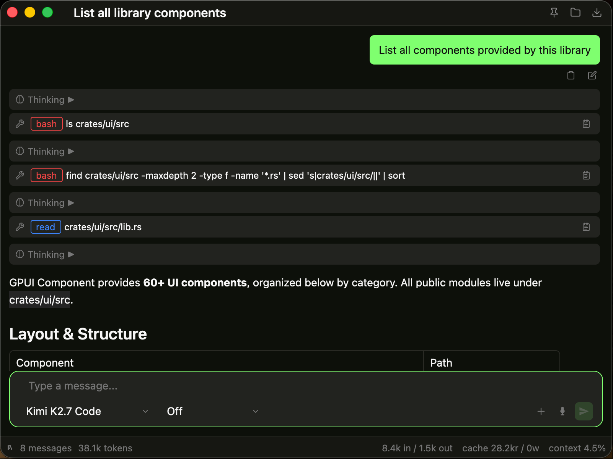

# Mini Pi

A fast, native desktop GUI for the [`pi`](https://github.com/earendil-works/pi-coding-agent) coding agent SDK. Built with Rust and [GPUI](https://github.com/zed-industries/zed) (the GPU-accelerated UI framework from the Zed editor).



## What is Mini Pi?

Mini Pi wraps the `pi` coding agent SDK in a native chat application. You can create threads, pick models and thinking levels, attach workspaces, and chat with an agent that can read files, run commands, and edit code. Sessions are persisted locally in SQLite, and your agent configuration can optionally sync across devices via Supabase.

## Features

- **Native chat threads** — one window per conversation, pinned/unpinned thread list, search, and workspace filters
- **Model & thinking controls** — switch models and reasoning levels per thread
- **Workspace support** — point a thread at a project directory; the agent can read and execute commands in context
- **`@` mentions & `/` commands** — autocomplete files, folders, and slash commands in the composer
- **Inline tool calls & reasoning** — collapsible thinking blocks plus rendered bash/read/edit tool steps
- **Media & voice input** — attach images and use microphone input with remote transcription
- **Skills, extensions & prompts manager** — browse the ClawHub skill registry and npm extensions, or write custom prompts
- **Mini apps** — image generation and journal web apps hosted in an embedded WebView
- **System tray** — show/hide, create thread, and quit from the menu bar
- **Supabase sync** — authenticate to sync `~/.mini-pi/agent/` files across devices
- **Phone remote control** — optional Cloudflare Tunnel exposes a REST/SSE API so you can send messages from your phone



## Install

Prebuilt installers are available on the [Releases](../../releases) page.

### macOS

Download `mini-pi-<version>-<arch>.dmg`, open it, and drag **Mini Pi** into your **Applications** folder.

### Windows

Download `mini-pi-<version>-<arch>.msi` and run it. The installer adds a **Mini Pi** shortcut to the Start Menu and Desktop.

> The installer bundles its own Bun runtime and the SDK bridge, so you do not need to install Bun or Node.js separately.

## Build from source

### Prerequisites

- Rust stable >= 1.92
- [Bun](https://bun.sh) (for development bridge builds)
- macOS: Xcode Command Line Tools
- Linux: Vulkan drivers, `libxcb`, `libxkbcommon`, `libfontconfig`, `libssl`
- Windows: Vulkan SDK or DirectX

### Run in development

```bash
# Install the SDK bridge dependencies
cd pi-bridge && bun install && cd ..

# Run the app
cargo run

# Run tests
cargo test
```

### Build release installers locally

**macOS:**

```bash
./scripts/build-macos.sh
```

**Windows (PowerShell):**

```powershell
pwsh -ExecutionPolicy Bypass -File scripts\build-windows.ps1
```

Both scripts compile a release binary, bundle the bridge with Bun, and produce an installer in `target/`.

## Configuration

The app stores data in platform-appropriate locations:

| Path | Purpose |
|------|---------|
| `~/.mini-pi/mini-pi.db` | SQLite database (threads, workspaces, settings) |
| `~/.mini-pi/sessions/*.jsonl` | Conversation history used by the SDK |
| `~/.mini-pi/agent/` | Agent configuration, skills, and prompts |
| `~/.config/mini-pi/config.json` | App settings (font size, theme, remote control) |

Optional environment variables for auto-generated thread titles via Cloudflare AI Gateway:

- `CLOUDFLARE_API_KEY`
- `CLOUDFLARE_ACCOUNT_ID`
- `CLOUDFLARE_GATEWAY_ID`

## Remote control

Enable **Remote Control** in the settings panel to start a local HTTP server and a Cloudflare Tunnel. You can then send messages and receive live replies from another device. See [`docs/remote-api.md`](docs/remote-api.md) for the REST/SSE API.

## Architecture at a glance

- **Rust + GPUI** renders the UI and manages state.
- **`pi-bridge/`** is a local Bun/WebSocket server that loads the `pi` SDK and exposes it over a single multiplexed WebSocket.
- **SQLite** stores threads and settings; sessions are saved as JSONL files.
- **Supabase** handles auth and optional agent-config sync.
- **Cloudflare Tunnel** powers optional phone remote control.

For more details, see [`AGENTS.md`](AGENTS.md) and the docs in [`docs/`](docs/).

## License

MIT
